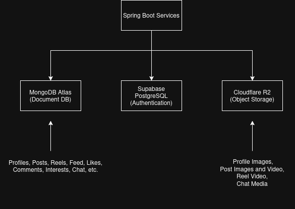
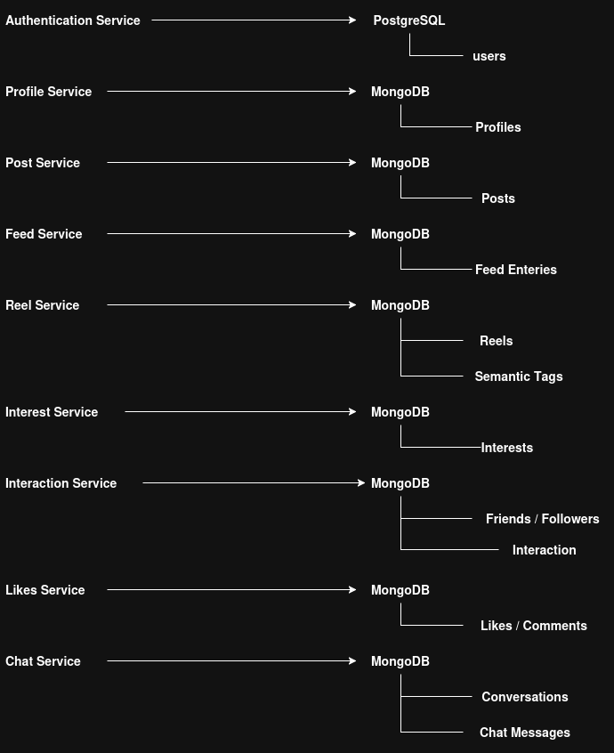

# Database Architecture

## Overview

The Social Media Backend adopts a polyglot persistence approach, where different storage technologies are used based on the requirements of each service rather than relying on a single database for the entire platform.

The project uses Supabase PostgreSQL to store authentication data, MongoDB Atlas for application documents and metadata, and Cloudflare R2 as object storage for images and videos. Media belonging to different services is organized using service-specific object prefixes within a single Cloudflare R2 bucket, providing logical separation while keeping storage management simple.

This database architecture follows the database-per-service principle, enabling each microservice to independently manage and evolve its own data while maintaining clear ownership boundaries.

## Database Strategy

The platform follows a database-per-service architecture where each microservice owns and manages its own data. Rather than sharing a single database across all services, every service is responsible for maintaining its own collections and exposing data only through service APIs.

Each service owns only the collections required for its business domain, while data required from other services is accessed through synchronous service communication rather than direct database access.

---

## Database Architecture

The platform uses three different storage technologies:

* Supabase PostgreSQL
* MongoDB Atlas
* Cloudflare R2

Each technology is responsible for storing a different category of data based on its characteristics and access patterns.

---

## Storage Technologies

### Supabase PostgreSQL

Supabase PostgreSQL is used exclusively by the Authentication Service.

Responsibilities include:

* User credentials
* Authentication data
* Password hashes
* User roles

A relational database is used because authentication data benefits from strong consistency, structured schemas, and relational constraints.

---

### MongoDB Atlas

MongoDB Atlas serves as the primary document database for the platform.

Collections managed by different services include:

* Profiles
* Posts
* Reels
* Feed entries
* User interests
* Semantic tag mappings
* Conversations
* Chat messages
* Likes
* Comments

Most platform entities naturally map to document structures and evolve independently across services. MongoDB's flexible schema allows individual services to introduce new fields without requiring coordinated schema migrations across the entire platform.

---

### Cloudflare R2

Cloudflare R2 is used as object storage for images and videos.

Media from different services is organized using service-specific object prefixes within a single bucket.

Examples include:

* `profile-pic/`
* `posts/`
* `reels/`
* `chat-media/`

Only object URLs are stored in MongoDB while the binary media remains in Cloudflare R2.

---

## Database Ownership

Each microservice owns its own collections.

Other services never access another service's database directly. Instead, required information is obtained through service-to-service communication.

This ownership model preserves service independence and prevents tight coupling between data stores.

---

## Denormalization Strategy

The platform intentionally denormalizes selected data to reduce synchronous service calls during read operations.

Examples include:

* User information embedded in posts
* User information embedded in reels
* User information embedded in comments
* User information embedded in interaction documents
* Feed entries storing post identifiers
* Popularity values stored within reels
* Post, reel, follower, and friend counts stored within user profiles
* Like and comment counts stored within posts and reels

Denormalization improves read performance by reducing cross-service communication during retrieval. The trade-off is that duplicated data must be synchronized whenever the source data changes, which is handled through asynchronous background operations.

---

## Data Relationships

Although services maintain separate databases, logical relationships still exist.

Examples include:

* Feed entries reference posts.
* Chat messages reference conversations.
* User interests reference semantic categories.
* Reels reference semantic mappings.
* Likes and comments reference posts or reels.

Relationships are maintained through identifiers rather than database joins. When additional information is required, services retrieve the corresponding data through synchronous service calls instead of directly querying another service's database.

---

## Current Trade-Offs

Advantages:

* Database-per-service architecture
* Independent schema evolution
* Flexible document storage
* Separation of structured, document, and object storage
* Reduced coupling between services

Limitations:

* Cross-service joins are not possible
* Denormalized data requires synchronization
* Additional service communication for related data
* Eventual consistency for replicated information

---

## Future Improvements

Potential enhancements include:

* Database sharding
* Read replicas
* Automated backup strategies
* Collection indexing optimizations
* Distributed caching
* Multi-region database deployment
* Lifecycle policies for media storage

---

## Conclusion

The database architecture combines relational storage, document databases, and object storage to meet the requirements of different services across the platform.

By following the database-per-service principle, each microservice maintains ownership of its data while communicating through service APIs. This approach supports independent service evolution, flexible schema design, and scalable storage for structured data, application documents, and media assets.

