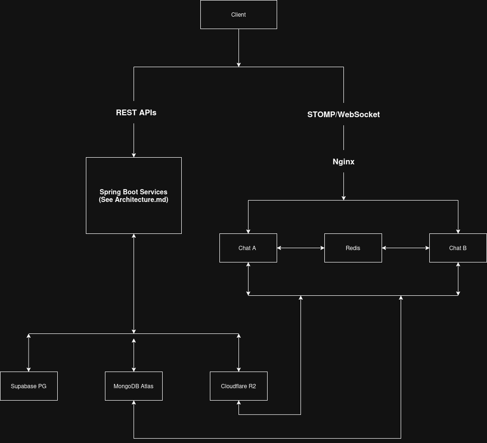
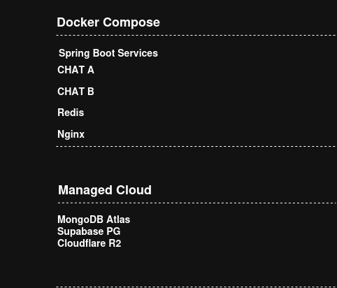

# Deployment Guide

## Overview

The Social Media Backend is deployed as a collection of independent Spring Boot microservices using Docker Compose. Most services run as a single container, while the Chat Service is deployed using multiple instances behind an Nginx reverse proxy to demonstrate horizontal scalability. Managed cloud services are used for persistent storage and object storage, while Redis is containerized to support inter-instance messaging.

Rather than hosting all infrastructure locally, the platform connects to managed cloud services including MongoDB Atlas for document storage, Supabase PostgreSQL for authentication data, and Cloudflare R2 for media storage. This approach reduces infrastructure management while preserving the distributed nature of the system.

---

## Deployment Architecture

The deployment consists of three logical layers:

* Infrastructure Layer
* Application Services Layer
* Client Layer

Infrastructure components provide persistence, messaging, networking, and object storage, while application services implement the business domains of the platform.

---

### Infrastructure Components

The deployment combines containerized application services with managed cloud infrastructure.

| Component           | Deployment       | Purpose                                          |
| ------------------- | ---------------- | ------------------------------------------------ |
| MongoDB Atlas       | Managed Cloud    | Primary document database for domain services    |
| Supabase PostgreSQL | Managed Cloud    | Authentication database                          |
| Redis               | Docker Container | Pub/Sub communication for Chat Service           |
| Cloudflare R2       | Managed Cloud    | Object storage for images and videos             |
| Nginx               | Docker Container | Reverse proxy and load balancer for Chat Service |

MongoDB Atlas, Supabase PostgreSQL, and Cloudflare R2 are accessed as managed cloud services over the internet, while Redis and Nginx run locally inside Docker Compose. This hybrid deployment reduces infrastructure management while maintaining a reproducible local development environment.

---

## Application Services

The deployment consists of multiple independently deployable services.

| Service                | Responsibility                          |
| ---------------------- | --------------------------------------- |
| Authentication Service | User authentication and JWT generation  |
| Profile Service        | User profile management                 |
| Post Service           | Post management                         |
| Feed Service           | Fan-out-on-write feed generation        |
| Reel Service           | Reel storage and recommendation ranking |
| Reel Fetch Service     | Recommendation orchestration            |
| Interest Service       | User interest management                |
| Interaction Service    | Friend and follow management            |
| Likes Service          | Likes and comments                      |
| View Service           | View tracking and popularity updates    |
| Chat Service           | Real-time messaging                     |

Each service owns its own business logic and communicates with other services through well-defined APIs.

---

## Container Networking

All application containers communicate through Docker's internal network.

Services communicate using container names rather than host IP addresses, allowing containers to be restarted or recreated without modifying application configuration.

Only externally required ports are exposed to the host system, while internal service communication remains isolated inside the Docker network.

---

## Service Communication During Deployment

Application services communicate using synchronous REST requests implemented with OpenFeign.

The Chat Service additionally uses:

* STOMP over WebSocket for client communication
* Redis Pub/Sub for inter-instance communication

This combination allows each service to remain independently deployable while supporting distributed workflows across the platform.

---

## Environment Configuration

Application configuration is externalized through environment variables.

Typical configuration includes:

* Database connection strings
* JWT secrets
* Internal service authentication tokens
* Cloudflare R2 credentials
* Redis configuration
* Service ports

Separating configuration from application code allows the same container images to be deployed across different environments without modification.

---

## Running the Platform

The complete backend can be started using Docker Compose after providing the required environment variables and infrastructure credentials.

Typical deployment process:

1. Configure environment variables.
2. Start Docker Compose.
3. Redis and Nginx containers are initialized.
4. Application service containers start.
5. Services establish connections to MongoDB Atlas, Supabase PostgreSQL, Cloudflare R2, and Redis.
6. Once the required cloud services are reachable and all application services complete initialization, the platform becomes available for client requests.

The deployment has been designed so that the complete application stack can be started from a single Docker Compose configuration after the required cloud service credentials have been configured.

---

## Horizontal Scaling

The current deployment demonstrates horizontal scaling using the Chat Service. Two Chat Service instances are deployed behind an Nginx reverse proxy, while Redis Pub/Sub propagates messaging events between instances.

Other application services currently run as single instances for simplicity, although their independent deployment model allows additional instances to be introduced if workload requirements increase.

---

## Deployment Considerations

The current deployment emphasizes simplicity and reproducibility.

Characteristics include:

* Independent service containers
* Hybrid deployment using managed cloud infrastructure
* Database-per-service architecture
* Internal Docker networking
* Object storage separated from application services
* Horizontal scaling demonstrated for the Chat Service

The deployment is intended for development, experimentation, and small-scale production environments.

---

## Current Trade-Offs

Advantages:

* Simple deployment process
* * Hybrid deployment using managed cloud services
* Clear service isolation
* Independent service deployment
* Production-like development environment

Limitations:

* Synchronous service communication
* No centralized service discovery
* No orchestration platform such as Kubernetes
* Manual environment configuration
* Limited automated deployment support

---

## Future Improvements

Potential deployment enhancements include:

* Kubernetes orchestration
* Automated CI/CD pipelines
* Service discovery
* Distributed configuration management
* API Gateway integration
* Container health monitoring
* Centralized log aggregation
* Automatic horizontal scaling

---

## Conclusion

The deployment architecture provides a reproducible environment for running the complete Social Media Backend using Docker Compose. Independent service containers, isolated infrastructure components, and container networking allow the platform to be deployed with minimal setup while preserving the characteristics of a distributed microservices architecture.

The current implementation demonstrates horizontal scalability through the Chat Service while the remaining microservices are deployed as independent single instances. This architecture allows additional services to be replicated in the future as workload requirements evolve.

The current deployment balances operational simplicity with architectural flexibility and provides a foundation for future migration to more advanced orchestration platforms.
