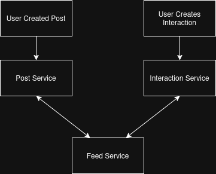

# Feed Generation Architecture

## Overview

The platform uses a fan-out-on-write strategy for post feed generation. Instead of constructing feeds at read time, feed entries are generated proactively when content is created or when new social relationships are established. This allows feed retrieval to remain lightweight and predictable while shifting complexity to write operations.

This approach prioritizes fast feed retrieval at the cost of additional work during content creation.

## Why Fan-Out On Write

Two common approaches exist for feed generation:

### Fan-Out On Read

When a user opens the application, the system collects posts from followed users, ranks them, and constructs the feed in real time.

Advantages:

* Lower write cost
* No feed duplication

Disadvantages:

* Higher feed retrieval latency
* Increased database load during reads
* Poor scalability for users following many accounts

### Fan-Out On Write

When a user creates a post, feed entries are generated immediately for followers.

Advantages:

* Fast feed retrieval
* Predictable read performance
* Simpler feed queries

Disadvantages:

* Higher write cost
* Feed storage duplication

The platform adopts fan-out-on-write because social applications typically experience significantly more feed reads than content creation operations.

## Feed Generation Workflow

### When a user creates a post:

1. Post Service stores the post.
2. Feed Service receives the post information.
3. Feed Service requests follower information from Interaction Service.
4. Followers are processed in batches.
5. Feed entries are generated for each follower.
6. Generated feed records are stored in Feed Service.

### When a user creates a new follow or friendship

1. Interaction Service creates an interaction.
2. Feed Service receives the interaction information.
3. Feed Service requests post information from Post Service.
4. Posts are processed in batches.
5. Feed entries are generated for each post.
6. Generated feed records are stored in Feed Service.

## Feed Retrieval Workflow

When a user requests a feed:

1. Feed Service retrieves feed entries for the user.
2. Associated post identifiers are collected.
3. Post Service is queried for post content.
4. Feed entries are assembled and returned to the client.

This design keeps retrieval operations lightweight because feed construction has already occurred during post creation.

Feed entries contain references to posts rather than duplicating post content. This keeps feed storage lightweight while allowing post data to remain owned by Post Service.

## Feed Service Responsibilities

The Feed Service is responsible for:

* Feed generation
* Feed storage
* Feed retrieval
* Feed pagination

The service does not own post content and relies on Post Service for post information.

## Scalability Considerations

Feed generation is separated from Post Service because feed creation has a different workload profile than content creation.

By isolating feed responsibilities:

* Post creation remains lightweight
* Feed generation can scale independently
* Future asynchronous processing can be introduced without modifying Post Service

## Current Trade-Offs

The current implementation uses synchronous service-to-service communication.

Advantages:

* Simpler implementation
* Easier debugging
* Lower infrastructure requirements

Limitations:

* Feed generation latency increases with follower count
* Dependent on service availability

## Future Improvements

Potential future enhancements include:

* Kafka-based asynchronous feed generation
* Background feed workers
* Feed caching
* Batch processing optimizations
* Celebrity account hybrid fan-out strategy

## Conclusion

The feed architecture prioritizes read performance through fan-out-on-write generation. While this increases write complexity, it enables predictable feed retrieval latency and aligns with the read-heavy workload characteristics of social media platforms.
