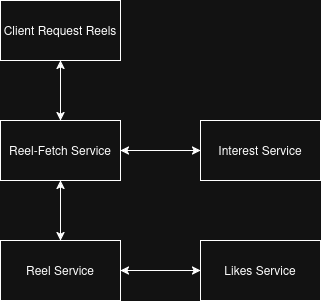
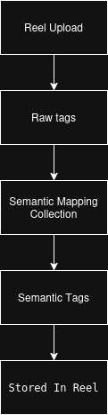
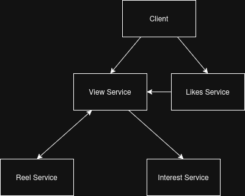

# # Recommendation System Architecture

## Overview

The recommendation system is responsible for delivering personalized reel content based on user interests, engagement history, and reel popularity.

Unlike the post feed system, which uses a fan-out-on-write approach, reel recommendations are generated dynamically when a user requests content. This enables recommendations to continuously adapt to changing user interests and engagement patterns.

The recommendation pipeline combines semantic tag classification, user interest modeling, engagement tracking, and popularity scoring to produce ranked reel recommendations.

## Why Fan-Out On Read

Two common approaches exist for recommendation delivery.

### Fan-Out On Write

Recommendations are precomputed and stored before users request content.

Advantages:

* Faster retrieval
* Lower read-time computation

Disadvantages:

* High storage requirements
* Difficult to adapt to changing interests
* Expensive recommendation updates

### Fan-Out On Read

Recommendations are generated when the user requests content.

Advantages:

* Dynamic recommendations
* Supports evolving interests
* Adapts to changing popularity trends
* No recommendation storage requirements

Disadvantages:

* Additional computation during retrieval
* Higher service coordination requirements

The platform adopts fan-out-on-read because recommendation quality depends on continuously changing user interests and reel popularity.

---

## Recommendation Architecture



The recommendation workflow is orchestrated through Reel Fetch Service.

Reel Fetch Service retrieves user interests from Interest Service and forwards them to Reel Service. Reel Service ranks available reels using interest matching and popularity scoring also fetching likes for the user from the likes service before returning recommendations to the client.

### Recommendation Retrieval Workflow

1. Client requests reels.
2. Reel Fetch Service receives the request.
3. User interests are fetched from Interest Service.
4. Interests are forwarded to Reel Service.
5. Reel Service ranks reels using interest alignment and popularity scores.
6. Reel Service enriches ranked reels with like information from Likes Service.
7. Ranked reels are returned through Reel Fetch Service to the client.

---

## Semantic Tag System

The recommendation engine relies on semantic tags rather than raw content tags.

When a reel is uploaded, raw tags are resolved into higher-level semantic categories using a semantic tag mapping collection.

Example mapping document:

```json
{
  "_id": "6a33a9bbbc2aaf47d99df907",
  "rawTag": "weightloss",
  "semanticTag": "fitness",
  "confidence": 0
}
```

Additional examples:

```json
{
  "rawTag": "cricket",
  "semanticTag": "sports"
}
```

```json
{
  "rawTag": "football",
  "semanticTag": "sports"
}
```

```json
{
  "rawTag": "java",
  "semanticTag": "programming"
}
```

Multiple raw tags can map to the same semantic category. This reduces category fragmentation and allows related content to contribute to a shared user interest profile.

### Confidence Field

The confidence field is reserved for future semantic classification enhancements.

The current implementation uses manually defined semantic mappings and therefore assigns a default confidence value of zero.

Future versions may introduce automated semantic classification capable of estimating how strongly a raw tag belongs to a semantic category. The confidence score could then be incorporated into recommendation ranking and interest calculations.

---

## Semantic Tag Resolution Workflow



When a reel is uploaded:

1. Raw tags are extracted.
2. Tags are resolved through the semantic mapping collection.
3. Semantic categories are attached to the reel.
4. The reel is stored with resolved semantic metadata.

These semantic categories are later used by both the recommendation engine and the interest system.

---

## Interest Modeling

Each user maintains an interest profile representing engagement across semantic categories.

Example:

```json
{
  "sports": {
    "score": 0.82,
    "lastUpdated": "2025-06-09T12:00:00Z"
  },
  "fitness": {
    "score": 0.64,
    "lastUpdated": "2025-06-09T12:00:00Z"
  },
  "programming": {
    "score": 0.37,
    "lastUpdated": "2025-06-09T12:00:00Z"
  }
}
```

Interest scores are updated through engagement events processed by View Service.

Current event boosts:

| Event    | Score Increase |
| -------- | -------------- |
| WATCH_50 | 0.06           |
| WATCH_90 | 0.12           |
| LIKE     | 0.20           |

Interest scores are decayed over time using an exponential decay function. This prevents historical engagement from permanently dominating a user's recommendation profile.

The recommendation engine prioritizes reels whose semantic categories align with the user's strongest interests.

---

## Popularity Scoring

In addition to personalized interests, reels maintain a popularity score.

Popularity is calculated using engagement activity and time-based decay.

Current implementation:

```text
engagementScore =
views + (likes × 5)

popularity =
engagementScore / hours^1.5
```

Where:

* Views contribute directly to engagement.
* Likes receive additional weighting.
* Older content gradually loses ranking influence.

This prevents older reels from permanently dominating recommendation results while still rewarding highly engaging content.

The popularity score is recalculated whenever view or like activity updates a reel.

---

## Interest and Popularity Update Workflow



User engagement events trigger recommendation updates.

Examples:

* WATCH_50
* WATCH_90
* LIKE

Workflow:

1. Client sends engagement event.
2. View Service receives the event.
3. View Service requests popularity updates from Reel Service.
4. Reel Service updates popularity metrics.
5. Reel Service returns semantic tags associated with the reel.
6. View Service forwards semantic tags and event type to Interest Service.
7. Interest Service updates the user's interest profile.

Like events follow the same workflow through View Service and contribute to both popularity and interest updates.

This design ensures that a single engagement event simultaneously affects both recommendation relevance and content popularity.

---

## Current Trade-Offs

The current implementation prioritizes simplicity and operational efficiency.

Advantages:

* Simple recommendation pipeline
* Easy debugging
* Low infrastructure requirements
* Transparent ranking behavior
* No recommendation storage overhead

Limitations:

* No machine learning ranking model
* Synchronous service communication
* Manual semantic tag classification
* Limited ranking signals compared to large-scale recommendation systems

---

## Known Limitation

Semantic mappings are resolved during reel creation.

If a new semantic mapping is introduced after content has already been processed, previously uploaded reels are not automatically reclassified.

Example:

Day 1:

* Reel uploaded with tag `cricket`
* No semantic mapping exists

Day 2:

* Mapping added: `cricket → sports`

Result:

* Existing reels remain unresolved
* Future reels are classified correctly

This limitation exists because semantic resolution currently occurs during content creation rather than through a background reclassification process.

---

## Future Improvements

Potential future enhancements include:

* Background content reclassification jobs
* Automated semantic tag generation
* Confidence-based semantic classification
* Recommendation caching
* Asynchronous event processing
* Additional ranking signals
* Machine learning ranking models
* Hybrid recommendation strategies

---

## Conclusion

The recommendation architecture combines semantic categorization, user interest modeling, engagement tracking, and popularity scoring to generate personalized reel recommendations.

By using a fan-out-on-read approach, the system continuously adapts to changing user behavior while remaining relatively simple to operate and deploy. The architecture provides a practical recommendation foundation while leaving room for future improvements in ranking quality and scalability.
