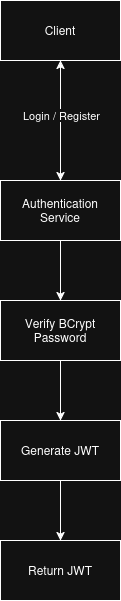
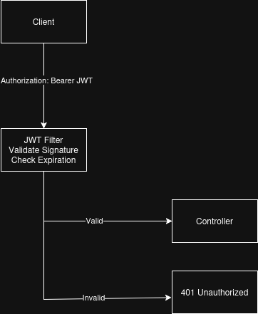
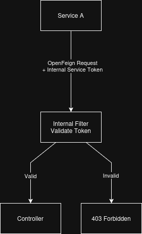

# Security Architecture

## Overview

The Social Media Backend secures both client requests and inter-service communication using separate authentication mechanisms. Client-facing APIs are protected using JWT-based authentication, while communication between trusted microservices is secured using dedicated internal service tokens.

Security is enforced through Spring Security filters before requests reach application controllers. Protected resources such as post creation, feed generation, recommendation retrieval, media uploads, and chat operations require successful authentication, while internal service endpoints additionally validate internal service credentials.

Media uploads follow the same security model. Clients must first authenticate before requesting a temporary upload URL, preventing unauthorized users from directly uploading content to Cloudflare R2.

The current implementation focuses on stateless authentication, secure service-to-service communication, and endpoint protection while providing a foundation for future authorization features such as role-based access control.

---

## Security Goals

* Secure user authentication
* Stateless request authentication using JWTs
* Protected internal service communication
* Secure media upload access
* Protected API endpoints
* Separation between external and internal requests

---

## Authentication

Users authenticate through the Authentication Service.

Authentication workflow:

1. User submits credentials.
2. Authentication Service validates credentials.
3. The submitted password is verified against the stored BCrypt hash.
4. JWT is generated.
5. JWT is returned to the client.
6. Client includes the JWT in future requests.

The backend remains stateless by validating JWTs on each protected request rather than maintaining server-side sessions.

---

## JWT Validation

Protected endpoints require a valid JWT.

Request processing:

1. Client sends a request with a JWT in the Authorization header.
2. JWT Filter extracts the token.
3. The token signature and expiration are validated.
4. The authenticated user identity is established within the Security Context.
5. The request proceeds to the controller.

Requests containing invalid or expired tokens are rejected before reaching application logic.

---

## Internal Service Authentication

Microservices communicate using internal authentication tokens.

Workflow:

1. Service A sends a request.
2. Internal authentication token is attached.
3. Receiving service validates the token.
4. Authorized internal requests proceed.
5. Unauthorized requests are rejected.

This prevents external clients from directly invoking internal APIs.

---

## Endpoint Protection

The platform separates public endpoints from protected endpoints.

Public endpoints include:

* User registration
* User login

Protected endpoints require successful authentication before processing.

Internal service endpoints additionally require valid internal service authentication.

---

## Password Security

User passwords are never stored in plain text.

During registration, passwords are hashed using BCrypt before being persisted by the Authentication Service. During login, the submitted password is verified against the stored BCrypt hash rather than being decrypted.

Using BCrypt protects stored credentials by incorporating a computationally expensive hashing algorithm with a unique salt for each password, reducing the effectiveness of brute-force and precomputed dictionary attacks.

---

### Media Security

Media uploads are protected through authenticated REST endpoints before any interaction with Cloudflare R2 occurs.

Upload workflow:

1. Client authenticates using a valid JWT.
2. Client requests a temporary upload URL.
3. The backend validates the JWT and extracts the authenticated user's identity.
4. File metadata is validated, including supported content types.
5. The original filename is sanitized before generating the storage key.
6. A pre-signed upload URL is generated for Cloudflare R2.
7. The client uploads the file directly to Cloudflare R2 using the temporary URL.

This approach prevents storage credentials from being exposed to clients while ensuring that only authenticated users can upload supported media types.

---

## Security Considerations

The current security implementation is based on the following principles:

* Stateless JWT-based authentication
* Authentication before protected resource access
* Dedicated internal authentication for service-to-service communication
* Separation of external client APIs and internal service endpoints
* BCrypt password hashing
* Secure media uploads using authenticated pre-signed URL generation
* Input validation for uploaded media types and file names

---

## Current Trade-Offs

Advantages:

* Stateless JWT-based authentication
* Secure internal service communication
* BCrypt password hashing
* No server-side session management
* Independent service security
* Authenticated media upload workflow

Limitations:

* Shared internal service tokens
* No API Gateway
* No refresh token rotation 
* No role-based authorization beyond authenticated user access

---

## Future Improvements

Potential enhancements include:

* Role-based access control for administrative services
* Refresh token rotation
* API Gateway for centralized authentication and request routing
* OAuth2 / OpenID Connect integration
* Rate limiting for public APIs
* Mutual TLS for service-to-service communication
* Secret management using Vault or cloud secret managers
* Distributed authorization policies

---

## Conclusion

The security architecture combines JWT-based client authentication with dedicated internal service authentication to protect both external APIs and inter-service communication. Additional security measures such as BCrypt password hashing, authenticated media uploads using pre-signed Cloudflare R2 URLs, and protected internal endpoints provide multiple layers of defense while keeping the system stateless.

The current implementation demonstrates a stateless security architecture using Spring Security, JWT authentication, dedicated internal service authentication, and authenticated media uploads. While intentionally simpler than large production systems, it provides secure request processing appropriate for the platform's current architecture.