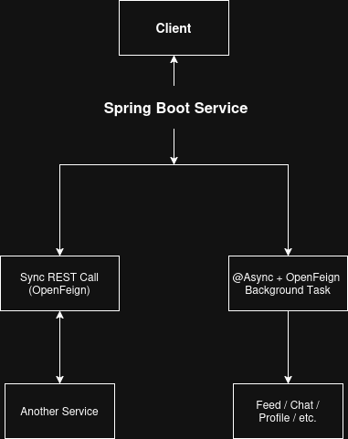
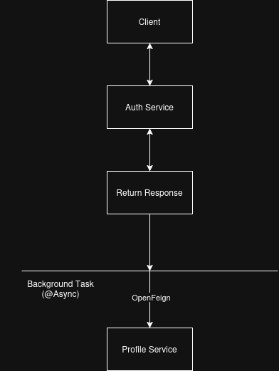
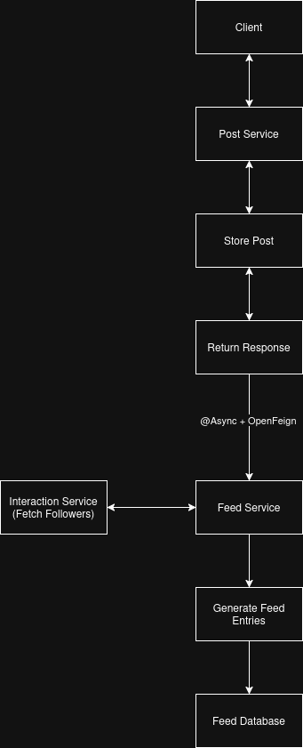
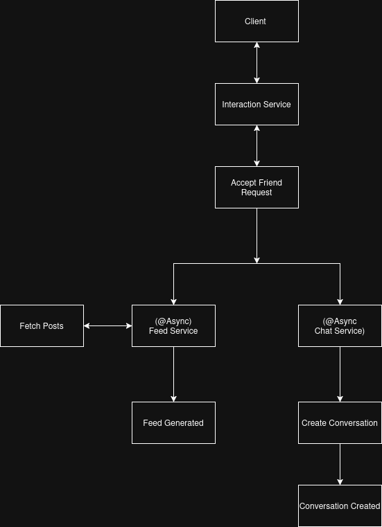
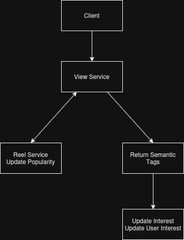

# Service Communication

## Overview

The platform combines synchronous OpenFeign communication for request-response workflows with asynchronous background tasks for non-critical side effects such as profile creation, feed generation, conversation creation, and denormalized data synchronization.

The communication model is chosen based on the consistency requirements of each workflow. Operations that are required to complete before responding to the client use synchronous communication, while non-critical side effects such as feed generation, denormalization, and conversation creation are processed asynchronously.

This hybrid communication model allows the platform to maintain responsive APIs while keeping related services synchronized.

---

## Communication Patterns

The platform primarily uses two communication patterns.

### Synchronous Communication

Synchronous communication is implemented using OpenFeign clients.

Synchronous communication is implemented using OpenFeign clients for service-to-service communication. It is used whenever a service requires data immediately to complete the current request before a response can be returned to the client.

Typical synchronous operations include:

* Authentication and authorization
* Profile retrieval
* Feed retrieval and feed enrichment
* Recommendation retrieval
* Post retrieval
* Like status retrieval
* User interest retrieval
* Conversation ID retrieval
* Chat history retrieval
* Media upload processing

Synchronous communication ensures that clients receive complete and consistent responses before the request is completed.

Some operations depend on data from other services before they can be completed safely. If a required synchronous dependency is unavailable, the primary operation is aborted rather than proceeding with incomplete or inconsistent data.

For example, when creating a post or reel, the service retrieves user profile information for denormalization before persisting the content. If the Profile Service is unavailable, the post or reel creation request fails because the required metadata cannot be obtained. This approach prioritizes data consistency over partial request completion.

---

### Asynchronous Communication

Asynchronous communication is implemented using Spring's `@Async` support.

Rather than delaying the client response, non-critical background operations are executed independently after the primary business operation has completed.

Examples include:

* Automatic profile creation after user registration
* Feed generation after post creation
* Feed generation after new follows or friendships
* Conversation creation after friendship acceptance
* Post and reel denormalization
* Like and comment count synchronization

This reduces response latency while maintaining eventual consistency between services.

---

## Internal Service Authentication

Inter-service communication is protected using internal service tokens.

Each service validates incoming internal requests before executing privileged operations. This prevents external clients from directly invoking internal APIs while allowing trusted microservices to communicate securely.

Client requests are authenticated using JWT tokens, whereas service-to-service communication relies on internal authentication.

---

## Communication Architecture

The platform combines synchronous request-response communication with asynchronous background processing.

User requests first complete the primary business operation. Additional side effects are then delegated to background tasks whenever immediate consistency is not required.

---

## User Registration Workflow

> 

When a new user registers:

1. Authentication Service creates the user account.
2. Authentication Service immediately returns the authentication response.
3. Profile Service is invoked asynchronously.
4. A default user profile is created.

Because profile creation is independent from authentication, user registration is not delayed by additional service operations.

---

## Post Creation Workflow

When a user creates a post:

1. Client submits the post.
2. Post Service stores the content.
3. Post Service immediately returns success.
4. Feed generation is triggered asynchronously.
5. Feed Service retrieves follower information from Interaction Service.
6. Feed entries are generated in batches.

This approach keeps post creation lightweight while allowing feed generation to scale independently.

---

## Social Interaction Workflow

When a follow or friendship is established:

1. Interaction Service stores the relationship.
2. Feed generation is triggered asynchronously.
3. Feed Service retrieves historical posts from Post Service.
4. Feed entries are created for the newly connected user.
5. Chat Service creates a conversation document for future messaging.

Separating these side effects from the primary interaction request reduces user-visible latency while ensuring the platform remains eventually consistent.

---

## Feed Retrieval Workflow

Feed retrieval is a synchronous orchestration process.

The workflow consists of:

1. Feed Service retrieves feed entries.
2. Feed Service requests post details from Post Service.
3. Feed Service requests like information from Likes Service.
4. The completed feed is returned to the client.

Because the client requires all information before rendering the feed, these operations are performed synchronously.

---

## Recommendation Retrieval Workflow

Recommendation generation also follows a synchronous orchestration model.

The workflow consists of:

1. Reel Fetch Service receives the request.
2. User interests are retrieved from Interest Service.
3. Interest information is forwarded to Reel Service.
4. Reel Service ranks reels using interest scores and popularity.
5. Reel Service enriches recommendations with like information from Likes Service.
6. Ranked recommendations are returned to the client through Reel Fetch Service.

Unlike Feed Service, Reel Fetch Service primarily coordinates recommendation retrieval while the ranking logic remains within Reel Service.

---

## Engagement Update Workflow

User engagement events update multiple services.

Examples include:

* WATCH_50
* WATCH_90
* LIKE

Workflow:

1. Client sends an engagement event.
2. View Service records the event.
3. View Service requests Reel Service to update popularity.
4. Reel Service recalculates popularity and returns semantic tags.
5. View Service forwards semantic tags and event information to Interest Service.
6. Interest Service updates the user's interest profile.

A single engagement event therefore contributes to both recommendation ranking and user interest modeling.

---

## Fault Tolerance

The platform uses Resilience4j to improve the reliability of inter-service communication.

Retry and Circuit Breaker patterns are applied to both synchronous and asynchronous service calls depending on the criticality of the workflow.

Typical use cases include:

* Automatic profile creation after user registration
* Feed generation after post creation
* Feed generation after new social interactions
* Conversation creation and deletion
* Profile denormalization
* Feed retrieval from dependent services
* Cleanup of likes and comments during content deletion

For asynchronous background operations, retries are attempted before the Circuit Breaker invokes a fallback method that records the failure for monitoring.

For synchronous retrieval operations, fallback methods return safe default responses when dependent services are unavailable. This prevents cascading failures while allowing the requesting service to degrade gracefully.

---

## Eventual Consistency

The platform intentionally adopts eventual consistency for background operations.

Examples include:

* Feed generation
* Conversation creation
* Profile creation
* Denormalized counter updates

Temporary inconsistencies may exist immediately after an operation completes, but affected services are synchronized shortly afterward through asynchronous processing.

This approach reduces request latency while maintaining acceptable consistency for social media workloads.

---

## Failure Handling

The communication model is designed to isolate failures while preventing them from unnecessarily affecting independent services.

For asynchronous background operations, transient failures are automatically retried using Resilience4j before the configured fallback method is invoked. If all retry attempts are exhausted, the failure is recorded through logging while the original client request remains successful. This allows background tasks such as feed generation, profile creation, conversation creation, and denormalization to fail independently without requiring the user to repeat the initiating action.

For synchronous operations, dependent service failures are handled according to the requirements of the workflow. Requests that require data to maintain consistency, such as post or reel creation with profile denormalization, are aborted if the required dependency is unavailable. For retrieval operations where partial responses are acceptable, fallback methods may return safe default responses to degrade gracefully instead of propagating the failure.

---

## Current Trade-Offs

Advantages:

* Clear separation between synchronous and asynchronous workflows
* Reduced client response latency
* Eventual consistency for non-critical operations
* Independent service deployment
* Simple service coordination using REST APIs

Limitations:

* Synchronous operations remain dependent on service availability
* No centralized message broker 
* Fallbacks currently provide logging or simplified responses rather than recovery workflows 
* No centralized retry queue
* No distributed transaction management
* Background tasks are processed within service instances

---

## Future Improvements

Potential enhancements include:

* Kafka-based event streaming
* Dedicated background worker services
* Distributed tracing
* Service discovery
* Event-driven communication for additional workflows

---

## Conclusion

The communication architecture combines synchronous REST communication with asynchronous background processing to balance responsiveness and consistency across the platform.

Critical request-response operations complete synchronously, while non-essential side effects execute asynchronously to reduce latency. This hybrid approach keeps services loosely coupled, supports independent deployment, and provides a practical communication model for a distributed social media backend while remaining extensible for future event-driven enhancements.

Critical service-to-service communication is further protected using retry and circuit breaker mechanisms implemented with Resilience4j.
