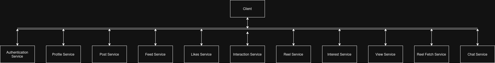

# System Architecture

The Social Media Backend is a distributed social networking platform
designed to support posts, reels, personalized feeds, user interactions,
and real-time messaging.

The system is implemented using a microservices architecture in which
each service owns a specific business domain and data model. This
approach enables separation of concerns and independent scalability.

The architecture emphasizes feed generation, recommendation systems,
and real-time communication while maintaining resilience against
partial service failures.

## System Goals

- Separation of concerns
- Independent service ownership
- Personalized content delivery
- Real-time messaging
- Fault tolerance
- Horizontal scalability

## High Level Architecture

The platform consists of multiple domain-oriented services.
Each service is responsible for a specific business capability
and owns its corresponding data.

## Service Overview

The platform is composed of domain-oriented services that separate
authentication, content management, recommendations, social interactions,
and real-time communication into independent deployment units.

| Service     | Responsibility          |
|-------------|-------------------------|
| Auth        | Authentication and JWT  |
| Profile     | User profile management |
| Post        | Post storage            |
| Reel        | Reel storage            |
| Feed        | Feed generation         |
| Reel Feed   | Reel retrieval          |
| Interest    | User interests          |
| View        | View tracking           |
| Interaction | Friends and followers   |
| Chat        | Real-time messaging     |
| likes       | likes and comments      |

## Data Ownership

The system follows a database-per-service approach where each service owns and manages its own persistence layer. This design reduces coupling between services, allows independent schema evolution, and improves service autonomy.

Services access external data through service-to-service communication rather than direct database access. This ensures that business rules remain encapsulated within the owning service.

Certain orchestration services such as View Service and Reel Fetch Service do not maintain dedicated persistent storage. Instead, they coordinate operations across other services and aggregate data required by business workflows.

| Service                | Owned Data                            |
| ---------------------- | ------------------------------------- |
| Authentication Service | User Credentials, Authentication Data |
| Profile Service        | User Profiles                         |
| Post Service           | Posts                                 |
| Feed Service           | User Feed Entries                     |
| Likes Service          | Likes, Comments                       |
| Interaction Service    | Friends, Followers, Following         |
| Reel Service           | Reels, Reel Metadata                  |
| Interest Service       | User Interests                        |
| Chat Service           | Chat Messages, Conversations          |
| View Service           | No Dedicated Database                 |
| Reel Fetch Service     | No Dedicated Database                 |

## Technology Stack

The platform is implemented using Java and Spring Boot microservices. MongoDB and Postgres from supabase is used as the primary persistence layer for domain-specific data storage while cloudflare R2 is used for storage of static data such as posts, reels, profile images, etc. Redis Pub/Sub enables cross-instance communication for horizontally scalable real-time chat functionality. Docker and Docker Compose are used to simplify deployment and local development by providing a reproducible execution environment.

| Category                | Technology                      |
| ----------------------- |---------------------------------|
| Language                | Java 17                         |
| Framework               | Spring Boot                     |
| Database                | MongoDB , Postgres , Cloudflare |
| Authentication          | JWT                             |
| Service Communication   | REST / OpenFeign                |
| Real-Time Communication | WebSocket                       |
| Messaging               | Redis Pub/Sub                   |
| Containerization        | Docker                          |
| Orchestration           | Docker Compose                  |
| Build Tool              | Maven                           |

## Conclusion

The architecture emphasizes separation of concerns through independently deployable microservices with clear ownership boundaries. Each service is responsible for a specific business domain while communicating through well-defined APIs.

The design prioritizes maintainability, scalability, and resilience while remaining deployable on modest infrastructure. Workloads such as feed generation, recommendation processing, view tracking, and real-time communication are isolated into dedicated services, allowing the platform to evolve without introducing unnecessary coupling between domains.

The resulting architecture provides a practical foundation for social networking workloads while demonstrating common distributed systems patterns including service decomposition, database ownership, real-time communication, recommendation pipelines, and fault-tolerant service interactions.