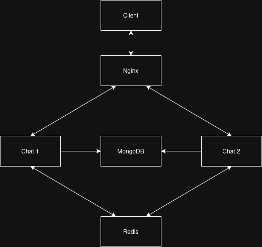
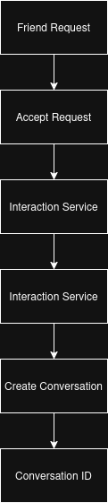
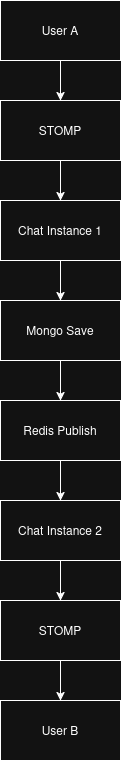
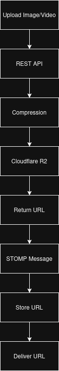
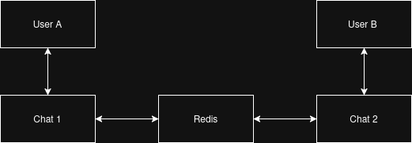

# Chat Service Architecture

## Overview

The Chat Service provides real-time messaging capabilities using STOMP over WebSocket connections.

Unlike traditional request-response services, the Chat Service maintains persistent client connections and supports low-latency communication between users.

The service is built around a conversation-based messaging model where all messages belong to a conversation. Conversations are automatically created when social relationships are established and serve as the primary communication channel between users.

To support horizontal scaling, Redis Pub/Sub is used for cross-instance message propagation, allowing users connected to different chat service instances to communicate seamlessly.

The Chat Service is also responsible for message persistence, conversation management, chat history retrieval, and media message delivery.

## Design Goals

* Real-time communication
* Low message delivery latency
* Conversation-based messaging
* Persistent message storage
* Horizontal scalability
* Independent deployment and scaling
* Fault isolation from other platform services

---

## Why a Dedicated Chat Service

Messaging workloads have significantly different requirements compared to traditional REST APIs.

Requirements include:

* Persistent STOMP over WebSocket connections
* Real-time message delivery
* Conversation management
* Chat history persistence
* Session management
* Cross-instance communication
* Media message support

Separating chat functionality into a dedicated service prevents messaging workloads from affecting content-oriented services such as Posts, Reels, Feed Generation, and Recommendations.

---

## High Level Architecture



The architecture consists of:

* STOMP Clients
* Chat Service Instances
* Redis Pub/Sub
* MongoDB
* Interaction Service
* Cloudflare R2

Clients establish persistent WebSocket connections with Chat Service instances. Messages are persisted in MongoDB and propagated across instances through Redis Pub/Sub.

Media files are uploaded through the Chat Service and stored in Cloudflare R2. The resulting URL is then transmitted through the messaging system.

---

## Conversation Model

The Chat Service uses a conversation-based architecture.

Conversation document example:

```json
{
  "_id": "6a2bb8165205d77026ae8c5d",
  "userId1": "1c50475c-c188-4839-99ac-aa27e40630de",
  "userId2": "3e5046eb-3c66-474d-9a10-937160576122",
  "createdAt": "2026-06-12T07:41:10.602Z"
}
```

Each conversation uniquely identifies a communication channel between two users.

Messages reference conversations rather than directly referencing recipient users.

This design simplifies chat history retrieval and conversation management.

---

## Conversation Creation Workflow



Conversations are automatically created after a successful social relationship is established.

Workflow:

1. User sends a friend request.
2. Request is accepted.
3. Interaction Service creates the relationship.
4. Interaction Service calls Chat Service.
5. Chat Service creates a Conversation document.
6. Conversation ID becomes available for future messaging.

This ensures users always have a valid conversation before message exchange begins.

---

## Conversation Retrieval Workflow

When a user opens the chat interface:

1. Client requests a conversation identifier.
2. Chat Service locates the conversation using both participant IDs.
3. Conversation ID is returned.
4. Client loads historical messages using the conversation ID.
5. Future messages are associated with that conversation.

The conversation ID acts as the primary identifier for all chat operations.

---

## Message Model

Messages are stored independently from conversations.

Example:

```json
{
  "messageId": "d1fd13a7-f4bf-4925-8f81-5b8adfdededd",
  "senderId": "1c50475c-c188-4839-99ac-aa27e40630de",
  "conversationId": "6a2bb8165205d77026ae8c5d",
  "type": "TEXT",
  "content": "hi",
  "createdAt": "2026-06-12T08:38:10.553Z",
  "delivered": false
}
```

Supported message types:

* TEXT
* IMAGE
* VIDEO

Messages belong to conversations and are retrieved through conversation-based queries.

---

## Message Delivery Workflow



When a user sends a message:

1. Client publishes a STOMP message.
2. Chat Service validates the conversation.
3. Message is persisted in MongoDB.
4. Message event is published to Redis.
5. Redis distributes the event across subscribed instances.
6. Recipient's connected instance receives the event.
7. Message is delivered through STOMP.

This workflow ensures message delivery regardless of which chat service instance each user is connected to.

---

## Media Message Workflow



Media messages follow a different workflow than text messages.

Workflow:

1. Client uploads image or video using a REST endpoint.
2. Chat Service compresses the media.
3. Processed media is uploaded to Cloudflare R2.
4. Public media URL is returned.
5. Client sends the URL through STOMP.
6. URL is stored as a chat message.
7. Recipient receives the media URL through the normal messaging pipeline.

This approach prevents large media payloads from being transferred through WebSocket connections.

---

## Multi-Instance Communication



The platform supports multiple Chat Service instances running simultaneously.

Example:

* User A connected to Chat Instance 1
* User B connected to Chat Instance 2

Redis acts as an event propagation layer:

1. Instance 1 publishes a message event.
2. Redis broadcasts the event.
3. Instance 2 receives the event.
4. Instance 2 delivers the message to User B.

This architecture removes the requirement for users to be connected to the same service instance.

---

## Message Persistence and Ordering

Messages are persisted before publication to Redis.

Benefits:

* Durable chat history
* Recovery after service restart
* Conversation reconstruction
* Historical message retrieval

MongoDB acts as the source of truth while Redis serves as a transient transport layer.

Message ordering is reconstructed using persisted creation timestamps during chat history retrieval. The current implementation does not use a dedicated ordering service.

---

## Scalability Considerations

The chat architecture supports horizontal scaling.

Additional Chat Service instances can be introduced behind a load balancer without requiring application-level changes.

Scaling process:

1. Deploy additional Chat Service instances.
2. Connect instances to Redis.
3. Route WebSocket traffic through a load balancer.
4. Redis propagates messages between instances.

This allows connection capacity to scale independently from the rest of the platform.

---

## Current Trade-Offs

Advantages:

* Horizontally scalable architecture
* Persistent message storage
* Conversation-based organization
* Low latency communication
* Simple deployment model

Limitations:

* Redis Pub/Sub does not provide message durability
* No delivery acknowledgement mechanism
* No distributed presence tracking
* Message ordering relies on persistence timestamps
* Limited advanced messaging features

---

## Future Improvements

Potential future enhancements include:

* Read receipts
* Delivery acknowledgements
* Typing indicators
* User presence tracking
* Group conversations
* Message reactions
* Kafka-based event streaming
* Distributed session management

---

## Conclusion

The Chat Service provides a dedicated real-time communication layer built around conversations, persistent storage, STOMP messaging, and Redis Pub/Sub based horizontal scaling.

The architecture supports text, image, and video messaging while maintaining conversation history and enabling communication across multiple service instances. The design demonstrates distributed systems concepts including event propagation, persistent messaging, conversation management, and horizontally scalable real-time communication.
